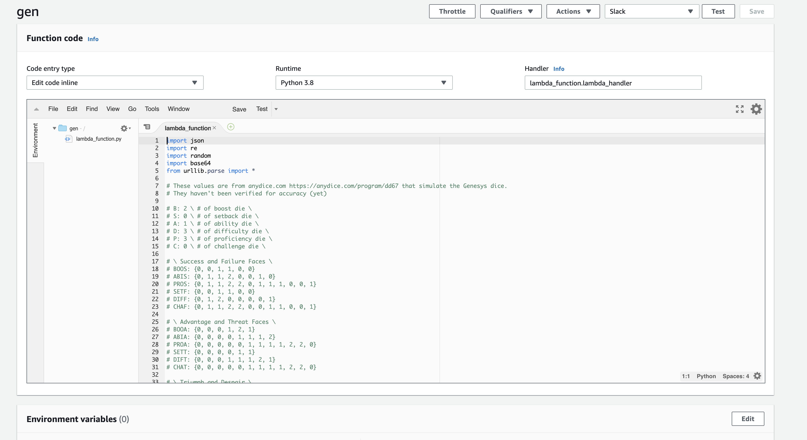

# Genesys RPG Dice Roller

Basic dice roller to be used as a AWS Lambda Script.

I use this as a [Slack command](https://api.slack.com/interactivity/slash-commands) `/gen` for a play-by-post game I run for some friends, but it's just an HTTP API that returns JSON.  Use it for your own entertainment.

## Deployment

Just copy the script into the IDE of an AWS Lambda. 🙄



## Return Value

The return value of the script is a Slack command specific JSON message that you will likely have to alter to make it work with whatever system you have.

```
{
    'statusCode': 200,
    'headers' : { 'Content-type' : 'application/json' },
    'body': { 'text' : results, 'response_type'  : 'in_channel' }
}
```

`results` is just the text dumped in the channel, with [Slack markdown](https://www.markdownguide.org/tools/slack/) attributes for emphasis. 

### TODO

*Error Handling*  - this could be spruced up.  I try and catch any non-valid text and report that as an error, but it doesn't exactly capture what is incorrect.

*Note* - A note about what the roll is for would be good.  Something like:

```
/gen A2 C1 D3 S1 # Descending the spider webs with archers shooting at you and spiders bearing down
```

*Better PRNG* - use a better random number generator than the one built into Python.  PCG perhaps?

## Credits

This is largely based on the script at [Anydice](http://anydice.com/program/dd67) that implements the faces.  Author unknown.

## License

Unlicense.  See `LICENSE`.